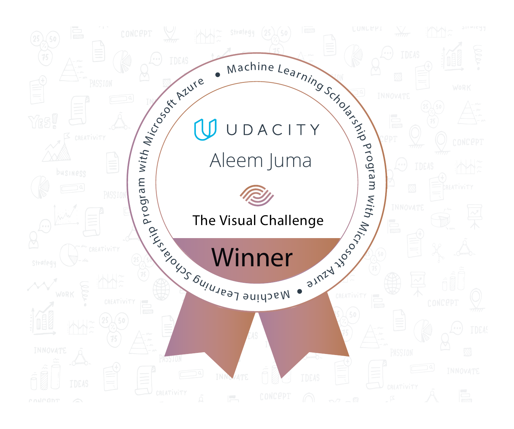

Notebooks, code and notes from the Udacity Microsoft Scholarship Foundations course

## Notebooks
* Lab 1: https://github.com/scign/ms-ml-azure-nano-foundations/blob/master/lab1_nyc-data.ipynb
* Lab 3: https://nbviewer.jupyter.org/github/scign/ms-ml-azure-nano-foundations/blob/master/lab2_bike-rental.ipynb
* Lesson subtitles download: https://nbviewer.jupyter.org/github/scign/ms-ml-azure-nano-foundations/blob/master/20200730-aj-udacity_youtube_subtitles_download.ipynb
* Lesson summary: https://nbviewer.jupyter.org/github/scign/ms-ml-azure-nano-foundations/blob/master/20200807-aj-udacity_lesson_summaries.ipynb

The Lesson Summary code put my visual in the top ten visuals submitted for the Visual Challenge in the course.

## Webinars
### Deploy a python flask app to Azure
* Recording: https://us02web.zoom.us/rec/play/68YscO2q_zk3HIWVtgSDC_EtW47vfaqsgSQZ-fcInRzkBiEGOgCvNLJGMeZGdRRJ36vFkI9MvxZx456Z
### NLP with spaCy
* Recording: https://us02web.zoom.us/rec/play/upIscrz6_D83GNWVtQSDBKV_W43rLq6s2nAd-KdbzkmzVHABMFLyYLERYbC1tOPE50t67YuyrgNKKTrx
* Notebook 1: https://nbviewer.jupyter.org/github/scign/ms-ml-azure-nano-foundations/blob/master/20200815-aj-spacy_demo.ipynb
* Notebook 2: https://nbviewer.jupyter.org/github/scign/ms-ml-azure-nano-foundations/blob/master/20200815-aj-spacy_demo_after_crash.ipynb

## Other code
* [Python practice challenge 01 - Character Input](https://github.com/scign/ms-ml-azure-nano-foundations/blob/master/PracticePython%2001%20Character%20Input.ipynb)
* [Python practice challenge 02 - Odd or Even](https://github.com/scign/ms-ml-azure-nano-foundations/blob/master/PracticePython%2002%20Odd%20or%20Even.ipynb)
* [Python practice challenge 03 - List Less Than 10](https://github.com/scign/ms-ml-azure-nano-foundations/blob/master/PracticePython%2003%20List%20Less%20Than%20Ten.ipynb)

## Lesson notes
Lesson 2
* Aleem: https://github.com/scign/ms-ml-azure-nano-foundations/blob/master/Lesson%202%20AJ.md
* Poornima: https://github.com/scign/ms-ml-azure-nano-foundations/blob/master/lesson_2.md

Lesson 3
* Aleem: https://github.com/scign/ms-ml-azure-nano-foundations/blob/master/Lesson%203%20AJ.md

## Datasets used
### Lab 1
* https://introtomlsampledata.blob.core.windows.net/data/nyc-taxi/nyc-taxi-sample-data.csv
### Lab 3
* https://introtomlsampledata.blob.core.windows.net/data/bike-rental/bike-rental-hour.csv
### Lab 4
* https://introtomlsampledata.blob.core.windows.net/data/crime-data/crime-dirty.csv
* https://introtomlsampledata.blob.core.windows.net/data/crime-data/crime-spring.csv
* https://introtomlsampledata.blob.core.windows.net/data/crime-data/crime-winter.csv